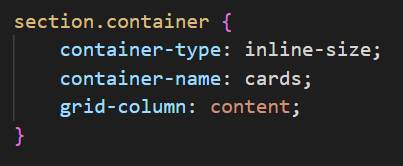
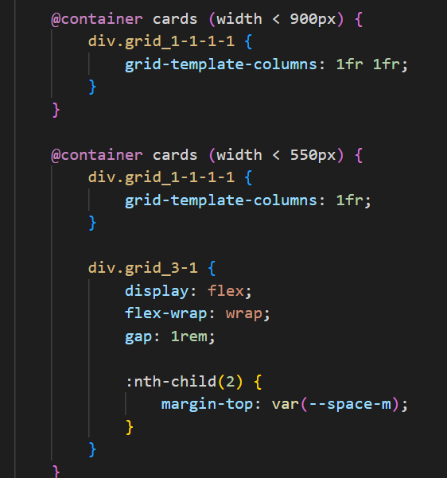
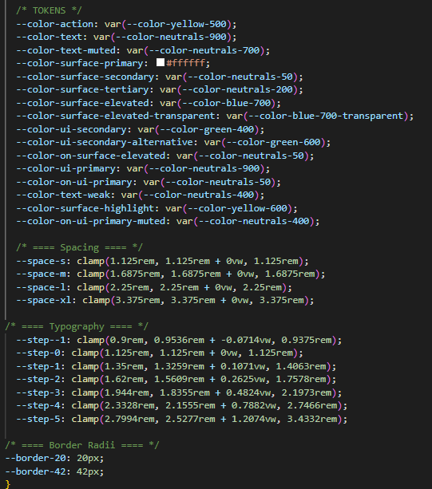

# Refleksion-delen

Vi har siddet sammen og skrevet refleksionen.

 

Ovenover kan man se billeder af et eksempel på hvordan vi har brugt container queries i opgaven. Måden vi har brugt container queries på er at lave wrapper rundt om core value indholdet. Derefter har den fået container-type: inline-size; og container-name: cards; som tillader os at bruge container queries. Længere nede i koden har vi så lavet to @container queries, som viser responsive versioner af komponentens layout, når der er mindre og mindre plads i containeren.

Container queries ser på bredden af komponenten, hvorimod media queries ser på viewporten. Dette gør at man kan bestemme størrelse af forskellige containere/komponenter. På denne måde kan man nemmere gøre designet mere responsivt uanset viewport.

Ovenover kan man se billeder af vores tokens og hvordan vi har brugt dem. Vi brugte tokens når vi skulle lave regler, der krævede f.eks. font størrelser og spacing. Til en anden gang skulle vi nok have et større udvalg af spacing tokens, da f.eks. nogle tokens ikke gav nok luft til vores elementer.

Tokens er smartere, da man kan genbruge dem på tværs af komponenter, og hvis man senere beslutter sig for at den røde farve skulle være orange, behøver man kun at rette det ét sted. Et effektivt og kontinuerligt system for at opretholde designet på tværs af undersiderne.

Vi har brugt Defensive CSS i vores CTAVariant knap. Her har vi sat display: inline-block til de brugte knapper. Dette gør at knapperne ikke karambolerer med andre elementer.

Vi har anvendt progressive enhancement ved at tage udgangspunkt i funktionalitet, der virker uden ekstra styling eller scripts. Et eksempel er vores FAQ, hvor vi bruger 
 og 
, som fungerer direkte i browseren. Derefter har vi tilføjet ekstra styling og animation med CSS, bl.a. via @supports, så browsere der understøtter det får en forbedret oplevelse, uden at det går ud over funktionaliteten i andre.

Vi har organiseret vores CSS i lag, hvor det globale indeholder de overordnede styles, som går igen på tværs af sider og komponenter. I components laget kan disse globale styles overskrives ved behov. Til sidst har vi et overwrite-lag til mere specifikke gentagelser, som fx den gule understregning, der bruges flere steder. På den måde undgår vi at gentage den samme kode på tværs af sider og komponenter.
